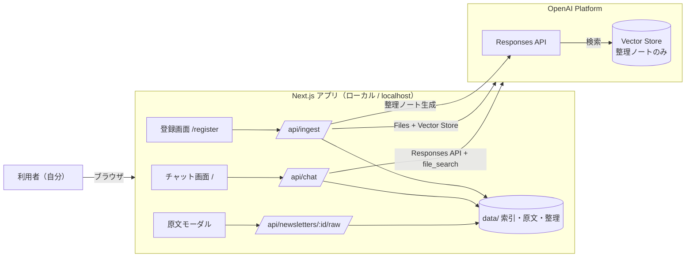
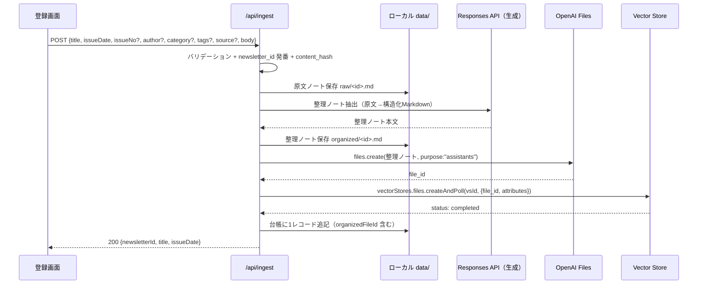
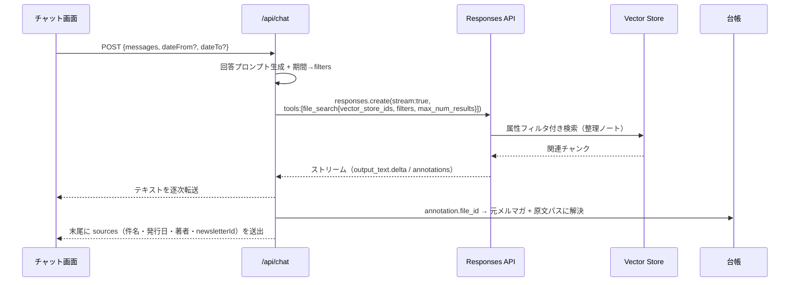
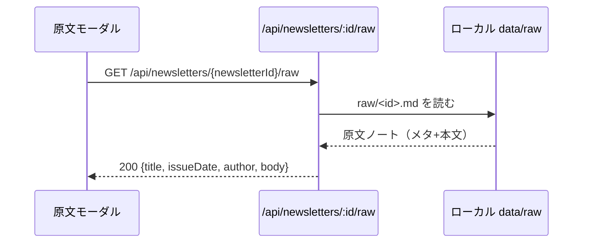

# アーキテクチャ設計

`docs/requirements.md` / [README.md](./README.md) の設計判断に基づくシステム構成。
知識は **原文ノート + 整理ノート** の2層（[data-model.md](./data-model.md)）。

---

## 1. システムコンテキスト



- 永続データは2か所：**OpenAI 側（Vector Store）= 整理ノートの検索基盤**、**ローカル `data/` = 原文・整理の本文 + メタデータ索引**。
- 原文ノートは MVP では Vector Store に登録しない（ローカルから閲覧）。

---

## 2. コンポーネント構成

| レイヤ | 要素 | 役割 |
|---|---|---|
| 画面 | `app/page.tsx`（チャット）、`app/register/page.tsx`（登録） | UI。クライアントコンポーネントで対話・ストリーミング・原文モーダル |
| API | `app/api/chat/route.ts`、`app/api/ingest/route.ts`、`app/api/newsletters/[id]/raw/route.ts` | OpenAI 連携・整理ノート生成・台帳更新・原文配信。Node.js ランタイム |
| ドメイン | `lib/openai.ts`、`lib/ingest.ts`、`lib/organize.ts`、`lib/vectorStore.ts`、`lib/ledger.ts`、`lib/prompt.ts` | 登録一連・整理ノート生成・VS 操作・台帳 I/O・プロンプト生成 |
| 型 | `lib/types.ts` | 共有型（NewsletterRecord, ChatMessage, Source 等） |

---

## 3. ディレクトリ構成

```
newsletter-ai-chat/
├─ app/
│  ├─ layout.tsx
│  ├─ page.tsx                       # チャット画面（既定）
│  ├─ register/page.tsx              # 登録画面
│  └─ api/
│     ├─ chat/route.ts               # POST: 整理ノート検索→回答（ストリーミング）
│     ├─ ingest/route.ts             # POST: 原文保存→整理ノート生成→VS登録
│     └─ newsletters/[id]/raw/route.ts # GET: 原文ノート本文を返す（閲覧用）
├─ components/
│  ├─ chat/                          # MessageList, MessageInput, SourceList, RawNoteModal, DateRangeFilter
│  └─ register/                      # NewsletterForm
├─ lib/
│  ├─ openai.ts                      # クライアント生成
│  ├─ ingest.ts                      # 登録の総合フロー
│  ├─ organize.ts                    # 整理ノート生成（LLM 抽出）
│  ├─ vectorStore.ts                 # アップロード・VS追加・属性・期間filters
│  ├─ ledger.ts                      # data/newsletters.json I/O
│  ├─ prompt.ts                      # 抽出/回答プロンプト
│  └─ types.ts
├─ scripts/
│  └─ create-vector-store.ts         # 初回セットアップ（VS作成→ID出力）
├─ data/                             # .gitignore 対象
│  ├─ newsletters.json
│  ├─ raw/<newsletter_id>.md
│  └─ organized/<newsletter_id>.md
├─ docs/
│  ├─ requirements.md
│  └─ design/...
├─ .env.local                        # シークレット（.gitignore 対象）
└─ .env.example
```

> `.gitignore` に `data/` と `.env.local` を追加。

---

## 4. レンダリング戦略

- **App Router**。チャット・登録は **クライアントコンポーネント**（`"use client"`）。
- `app/layout.tsx` はサーバコンポーネント（静的シェル + ナビ）。
- **API ルートは Node.js ランタイム固定**：`export const runtime = "nodejs"`。
  - 理由: ファイルアップロード（Buffer/`toFile`）、ローカル `fs` 読み書き（原文・整理・台帳）、LLM 呼び出しが必要。

---

## 5. データフロー

### 5.1 登録（ingest）— 原文保存 + 整理ノート自動生成 + VS 登録



### 5.2 チャット（chat）— 整理ノート検索 + 出典→原文リンク



### 5.3 原文閲覧（raw view）



---

## 6. 状態管理

- **会話履歴はクライアント保持**。送信時に直近メッセージ配列を `input` に。サーバはステートレス。
- 期間フィルタ（from/to）・原文モーダルの開閉もクライアント state。
- 登録フォームはローカル state（成功で入力クリア）。
- グローバル状態管理ライブラリは不要。

---

## 7. 環境変数

| 変数 | 必須 | 説明 |
|---|---|---|
| `OPENAI_API_KEY` | ✅ | OpenAI APIキー |
| `OPENAI_VECTOR_STORE_ID` | ✅ | 整理ノートを登録する Vector Store の ID |
| `OPENAI_MODEL` | 任意 | 既定 `gpt-4.1`。整理ノート生成・チャット回答に使用 |

`.env.example` にキー名のみ。実値は `.env.local`。

---

## 8. 初回セットアップ

1. `.env.local` に `OPENAI_API_KEY` を設定。
2. `scripts/create-vector-store.ts` を1回実行 → Vector Store を作成し ID を出力。
3. ID を `OPENAI_VECTOR_STORE_ID` に設定。
4. `npm run dev` → `/register` で登録、`/` でチャット。

---

## 9. エラーハンドリング方針

| 箇所 | 想定エラー | 対応 |
|---|---|---|
| ingest 入力 | 必須欠落・発行日不正 | 400 + フィールド単位の理由 |
| 整理ノート生成 | LLM 失敗/空応答 | 500 `organize_failed`。原文保存はロールバック（raw/<id>.md 削除）。台帳は未追記 |
| VS 登録 | Files/VS 失敗・`createAndPoll` が failed | 500。アップロード済みなら `files.del` 試行。台帳未追記 |
| chat | OpenAI 認証/レート/モデル/VS未設定 | 開始前は 500 JSON。開始後は本文末尾に `␞__ERROR__␞` 通知 |
| raw | id 不一致・ファイル無し | 404 `raw_not_found` |
| 共通 | 環境変数欠落 | 明示メッセージ（秘匿情報は含めない） |

> ingest は「原文保存 → 生成 → VS 登録 → 台帳追記」の順。**台帳追記は全成功時のみ**で、途中失敗は部分成果物（raw/organized/uploaded file）を可能な範囲で巻き戻す。

---

## 10. 技術スタックと依存

| 区分 | 採用 |
|---|---|
| フレームワーク | Next.js (App Router) + TypeScript |
| OpenAI 連携 | `openai`（公式 Node SDK, v6 系） |
| スタイル | Tailwind CSS（任意。最小なら素の CSS でも可） |
| 保管 | JSON 索引 + Markdown ファイル（`fs`）。将来 SQLite へ移行可能 |
| ランタイム | Node.js（API ルート） |

> Vercel AI SDK は MVP では不採用（依存最小化）。将来のストリーミング UI 強化の選択肢。
