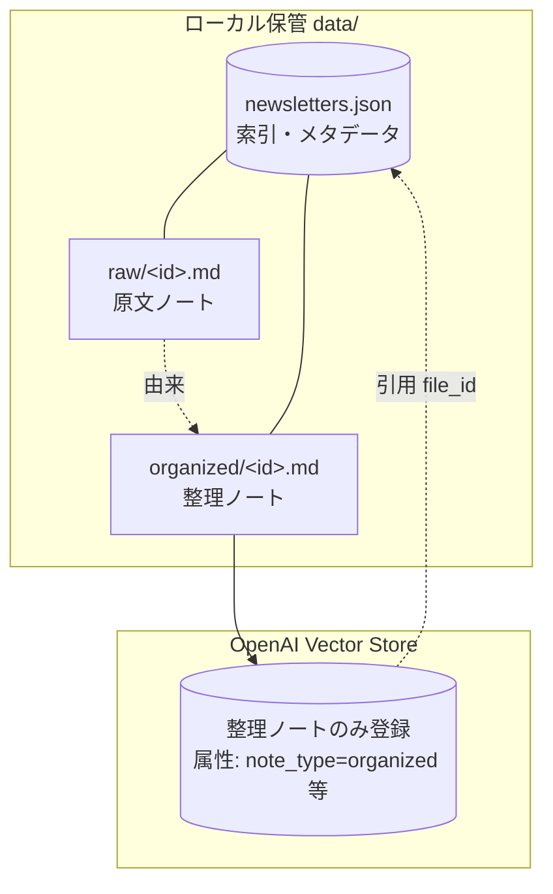

# データモデル設計（2層ノート）

知識を **原文ノート（第1段階）** と **整理ノート（第2段階）** の2層で管理する。
1メルマガ = 原文ノート1 + 整理ノート1 のペア（`newsletter_id` で対応付け）。

---

## 1. 全体像



- **原文ノート**: ローカル保管のみ（MVP では VS 非登録）。事実/出典確認・原文閲覧に使用。
- **整理ノート**: ローカル保管 + Vector Store 登録。チャット回答の検索対象。
- 引用解決: 回答の annotation `file_id`（整理ノート）→ 索引 → `newsletter_id` → 原文へリンク。

---

## 2. 原文ノート（第1段階）

### 2.1 保存項目

| 項目 | キー | 必須 | 備考 |
|---|---|---|---|
| 発行日 | `issueDate` / `issueDateUnix` | ✅ | `YYYY-MM-DD` と Unix 秒 |
| タイトル | `title` | ✅ | 件名 |
| 号数 | `issueNo` | 任意 | 例「第12号」 |
| 著者 | `author` | 任意 | |
| カテゴリ | `category` | 任意 | 単一分類 |
| タグ | `tags` | 任意 | 文字列配列 |
| 発行元 | `source` | 任意 | 媒体/メルマガ名 |
| 本文 | （ファイル本体） | ✅ | 貼り付けたテキストをそのまま |

### 2.2 ファイル形式（`data/raw/<newsletter_id>.md`）

```markdown
---
newsletter_id: 7b9d...-uuid
title: 週刊〇〇通信 第12号
issue_date: 2024-01-15
issue_no: 第12号
author: 山田太郎
category: マーケティング
tags: [価格設定, 新規事業]
source: 〇〇社メルマガ
---

〈メルマガ本文（原文そのまま）〉
```

> 原文は改変しない。ヘッダは保管・閲覧用メタ情報。

---

## 3. 整理ノート（第2段階）

### 3.1 保存項目（構造）

原文から抽出した構造化 Markdown。**⏱ 時事依存** と **♾ 一般原則** を明示分離する。

| セクション | 内容 |
|---|---|
| 要点サマリ | 3〜5行の概要 |
| 著者の主張 | 主要な主張・結論 |
| 判断基準 | 意思決定の基準・観点 |
| ノウハウ・手法 | 再現可能な手順・コツ |
| ♾ 考え方・原則（一般化） | 時期に依存しない、現在も応用できる原則 |
| 具体例 | 著者が挙げた例・ケース |
| 注意点・落とし穴 | 失敗パターン・留意点 |
| ⏱ 発行当時の状況に依存する情報 | 価格・制度・仕様・時事。可能なら「〇年時点」明記 |
| キーワード/関連トピック | 検索性向上の補助（任意） |

### 3.2 ファイル形式（`data/organized/<newsletter_id>.md`）

```markdown
---
newsletter_id: 7b9d...-uuid
note_type: organized
title: 週刊〇〇通信 第12号
issue_date: 2024-01-15
author: 山田太郎
category: マーケティング
tags: [価格設定, 新規事業]
source: 〇〇社メルマガ
---

## 要点サマリ
...

## 著者の主張
...

## 判断基準
...

## ノウハウ・手法
...

## ♾ 考え方・原則（現在も応用できる）
...

## 具体例
...

## 注意点・落とし穴
...

## ⏱ 発行当時の状況に依存する情報（2024年時点）
...

## キーワード
価格設定, バリュープライシング, 新規事業, ...
```

> このファイルを Vector Store にアップロードする（属性付き）。

---

## 4. 関連付けとローカル保管レイアウト

```
data/
├─ newsletters.json            # 索引（1メルマガ=1レコード）
├─ raw/<newsletter_id>.md       # 原文ノート
└─ organized/<newsletter_id>.md # 整理ノート
```

### 4.1 台帳（`data/newsletters.json`）スキーマ

```typescript
// lib/types.ts
interface NewsletterRecord {
  newsletterId: string;       // UUID（原文/整理ペアの主キー）
  title: string;
  issueDate: string;          // "YYYY-MM-DD"
  issueDateUnix: number;      // Unix 秒（00:00:00）
  issueNo?: string;
  author?: string;
  category?: string;
  tags: string[];             // 配列で保持
  source?: string;
  rawPath: string;            // "data/raw/<id>.md"
  organizedPath: string;      // "data/organized/<id>.md"
  organizedFileId: string;    // VS 登録した整理ノートの file_id（引用解決キー）
  contentHash: string;        // 原文本文の SHA-256（重複検知）
  createdAt: string;          // ISO8601
  // rawFileId?: string;      // 将来: 原文も VS 登録する場合
}

type Ledger = NewsletterRecord[];
```

### 4.2 例

```json
[
  {
    "newsletterId": "7b9d0c2e-1a3f-4b8c-9d2e-1f2a3b4c5d6e",
    "title": "週刊〇〇通信 第12号",
    "issueDate": "2024-01-15",
    "issueDateUnix": 1705276800,
    "issueNo": "第12号",
    "author": "山田太郎",
    "category": "マーケティング",
    "tags": ["価格設定", "新規事業"],
    "source": "〇〇社メルマガ",
    "rawPath": "data/raw/7b9d0c2e-....md",
    "organizedPath": "data/organized/7b9d0c2e-....md",
    "organizedFileId": "file_abc123",
    "contentHash": "a1b2c3d4e5...",
    "createdAt": "2026-06-02T10:30:00.000Z"
  }
]
```

### 4.3 運用ルール

- **追記は ingest 成功時のみ**（整理ノートの VS 登録が `completed` 後）。
- 単一ユーザー・小規模のため**読み込み→全体書き換え**で十分。
- 重複検知（任意）: 原文 `contentHash` 一致で 409/警告。

---

## 5. Vector Store ファイル属性スキーマ（整理ノート）

整理ノートのアップロード時に付与。**制約: 最大16キー / 値は string・number・boolean、文字列256文字以内**。

| キー | 型 | 例 | 用途 |
|---|---|---|---|
| `note_type` | string | `"organized"` | ノート種別（将来 `"raw"` 追加時の区別） |
| `newsletter_id` | string | `"7b9d..."` | 原文へのリンク解決 |
| `issue_date` | number | `1705276800` | 発行日 Unix 秒（期間絞り込み `gte`/`lte`） |
| `issue_date_str` | string | `"2024-01-15"` | 表示用発行日 |
| `title` | string | `"週刊〇〇通信 第12号"` | 件名（256文字以内） |
| `author` | string | `"山田太郎"` | 著者（`eq` で将来絞り込み可） |
| `category` | string | `"マーケティング"` | カテゴリ（`eq` 可） |
| `tags` | string | `"価格設定,新規事業"` | タグ（カンマ連結。配列非対応のため） |
| `source` | string | `"〇〇社メルマガ"` | 発行元（任意） |
| `issue_no` | string | `"第12号"` | 号数（任意） |

キー数 10（上限16内）。

### 期間フィルタ（chat 時）

```jsonc
// dateFrom=2024-01-01, dateTo=2024-12-31
{
  "type": "and",
  "filters": [
    { "type": "gte", "key": "issue_date", "value": 1704067200 },
    { "type": "lte", "key": "issue_date", "value": 1735689599 }   // その日の 23:59:59
  ]
}
```

- 片側のみ指定可。両方未指定なら `filters` を付けない。
- （MVP では `note_type` は実質 organized のみだが、将来 raw を混在させたら `{type:"eq",key:"note_type",value:"organized"}` を AND する。）

---

## 6. メタデータの扱い（まとめ）

- **発行日**: Unix 秒（数値）を正とし、表示用文字列を併存（期間絞り込みに必須）。
- **著者・カテゴリ・号数**: 属性に保持。`eq` フィルタで将来の絞り込み UI に対応可能。
- **タグ**: 配列非対応のためカンマ連結文字列で属性化。厳密フィルタは限定的で、主に整理ノート本文の意味検索で活用。
- 原文・整理の両方に共通メタデータを保持し、整合を取る。

---

## 7. 引用（出典）の解決フロー

1. 回答 annotations から `file_id`（整理ノート）を取得。
2. 台帳を `organizedFileId === file_id` で検索 → `NewsletterRecord` を得る。
3. UI に「件名（発行日）／著者」を表示し、「原文を見る」で `rawPath` の内容を閲覧（[api.md](./api.md) §raw、[ui.md](./ui.md) §原文閲覧）。
4. 同一 `newsletter_id` の複数ヒットは1件に重複排除。
5. 台帳に無い file_id は filename フォールバック表示。
